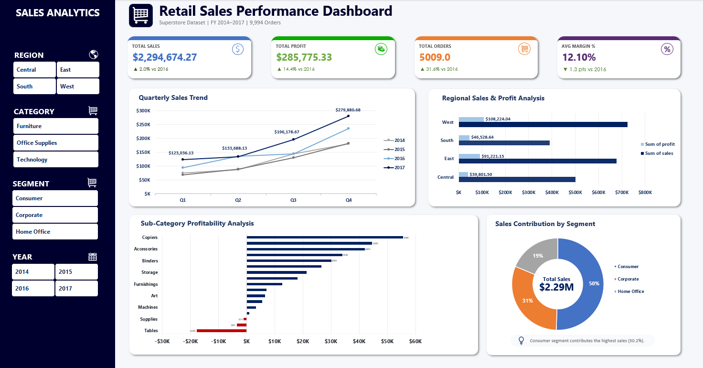
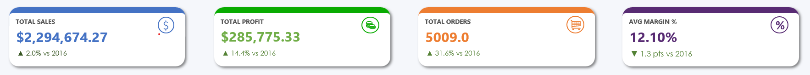
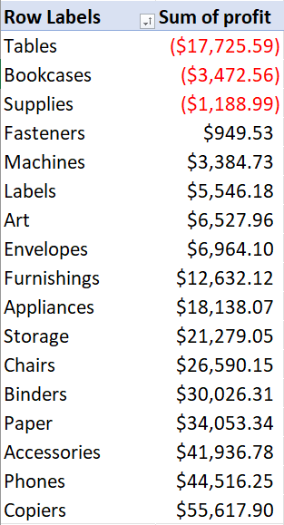
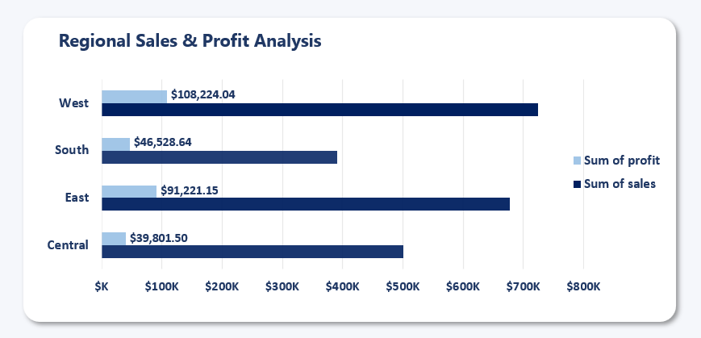
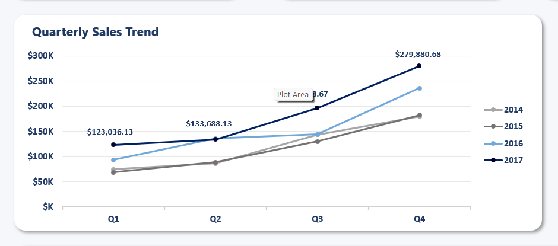
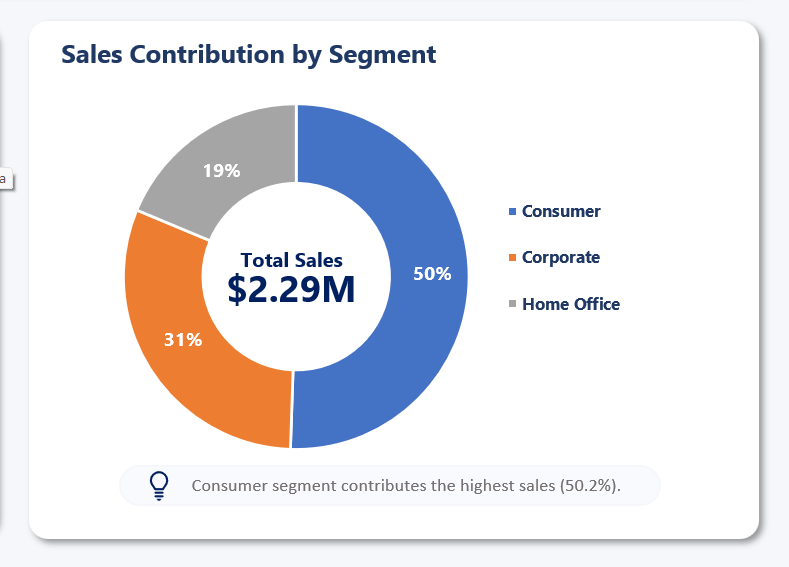

<div align="center">

# Retail Sales Performance Dashboard

**Excel | Pivot Tables | Slicers | Charts | Conditional Formatting**

Built an Excel dashboard analyzing $2.29M in sales across 9,994 orders, 4 regions, 3 product categories, and 3 customer segments to uncover where the business is making money — and where it is losing it.

This is not a reporting tool — it is a decision tool.

It answers one question clearly: **Which products, regions, and discount levels are hurting profitability — and what needs to change?**


</div>

---

## The Short Version

Total Sales: **$2,294,674.27**. Total Profit: **$285,775.33**. Avg Margin: **12.10%**. Total Orders: **5,009**.

The headline numbers look steady — sales up 2.0% vs 2016, profit up 14.4%. But underneath, two sub-categories are actively losing money. Tables is sitting at -$17,726 in profit on $207K in revenue. Supplies is loss-making. And the Central region — despite generating $501K in sales — has the lowest profit of any region at just $39,802.

This dashboard makes all of it visible in one view, with one-click filtering by Region, Category, Segment, and Year.

---

## The Core Problem

Retail businesses focus on top-line revenue. Sales grow, orders grow — and the underlying margin problem grows with them.

The Superstore dataset covers 4 years of US transactions from 2014 to 2017. Revenue grew every year. But that growth masks products being sold at a loss, a region with structurally weak margins, and discount levels that are destroying profitability order by order.

Without a clear view of profit by sub-category, region, and customer segment — there is no way to tell which parts of the business are worth investing in.

---

## Full Dashboard View



---

## Key Findings

### KPI Summary

Four headline KPIs at the top of the dashboard — Total Sales, Total Profit, Total Orders, and Avg Margin % — each with year-over-year comparison vs 2016.



| Metric | Value | vs 2016 |
|---|---|---|
| Total Sales | $2,294,674.27 | ▲ 2.0% |
| Total Profit | $285,775.33 | ▲ 14.4% |
| Total Orders | 5,009 | ▲ 31.6% |
| Avg Margin % | 12.10% | ▼ 1.3 pts |

---

### Tables and Supplies are loss-making sub-categories

The Sub-Category Profitability Analysis chart makes the problem immediately visible. Tables is the worst performer — negative profit on $207K in revenue. Supplies is also in the red. Every other sub-category is profitable. These two are pulling down the overall Furniture and Office Supplies category margins.



| Sub-Category | Profit | Status |
|---|---|---|
| Copiers | $55,618 | Best performer |
| Accessories | $41,937 | Strong |
| Binders | $30,026 | Positive |
| Supplies | -$1,189 | Loss-making |
| Tables | -$17,726 | Worst performer |

---

### West leads — Central has the weakest profit

West generates the highest profit at $108,224. East follows at $91,221. South at $46,529. Central, despite $501K in sales, delivers the lowest profit of any region at $39,802.



| Region | Sum of Sales | Sum of Profit |
|---|---|---|
| West | $724,832 | $108,224 |
| East | $677,868 | $91,221 |
| Central | $501,105 | $39,802 |
| South | $390,870 | $46,529 |

---

### Q4 2017 hit the highest quarter in the dataset

The Quarterly Sales Trend shows consistent growth across all four years. Q4 2017 reached $279,880 — the strongest single quarter on record. Q1 is always the weakest. The seasonal pattern repeats every year without exception.



| Quarter | 2017 Sales |
|---|---|
| Q1 | $123,036 |
| Q2 | $133,688 |
| Q3 | $196,179 |
| Q4 | $279,881 |

---

### Consumer drives half of all sales

The Sales Contribution by Segment donut shows Consumer at 50% of total sales ($2.29M), Corporate at 31%, and Home Office at 19%. Consumer is the largest segment by revenue — but not necessarily the most efficient by margin.



| Segment | Sales | Share |
|---|---|---|
| Consumer | $1,159,619 | 50% |
| Corporate | $705,719 | 31% |
| Home Office | $429,337 | 19% |

---

## What Should Be Done

| Problem | Action | Expected Impact |
|---|---|---|
| Tables losing -$17,726 on $207K revenue | Review discount policy on Tables — average discount is 30.6%, cap at 20% | Directly addresses the biggest profit drain in Furniture |
| Supplies in negative profit | Review supplier terms or discontinue the sub-category | Removes a loss-making line from the portfolio |
| Central region lowest profit despite $501K sales | Audit discount levels in Central — identify which customers receive >20% | Closes the gap between Central and other regions |
| Avg Margin down 1.3 pts vs 2016 | Reduce high-discount orders across all categories | Protects margin while revenue continues to grow |

---

## What the Dashboard Contains

### KPI Cards
Four numbers at the top — Total Sales, Total Profit, Total Orders, Avg Margin % — each with a year-over-year arrow vs 2016.

### Quarterly Sales Trend
Line chart showing quarterly sales from Q1 2014 to Q4 2017, with separate lines for each year. The growth trajectory and Q4 seasonal peak are immediately visible.

### Regional Sales and Profit Analysis
Horizontal bar chart comparing all four regions by both Sum of Sales and Sum of Profit side by side. West and East pull ahead clearly on profit even though Central has higher sales than South.

### Sub-Category Profitability Analysis
Horizontal bar chart ranking all sub-categories by profit — positive bars to the right, negative bars (Tables, Supplies) to the left in red. The two loss-makers stand out instantly.

### Sales Contribution by Segment
Donut chart showing Consumer, Corporate, and Home Office share of total $2.29M in sales.

### Interactive Slicers
Four slicers — Region, Category, Segment, Year — connected to all pivot tables and charts simultaneously. Click any slicer value and every chart updates at once.

---

## Pivot Analysis

Five pivot tables power the dashboard analysis — each answering a different business question.

| Pivot | Question It Answers |
|---|---|
| KPI Summary | What are the overall sales, profit, orders, and margin? |
| Quarterly Trend | How is performance changing quarter by quarter across years? |
| Regional Breakdown | Which regions generate the most profit — not just revenue? |
| Sub-Category Profitability | Which products are profitable and which are loss-making? |
| Segment Contribution | What share of sales does each customer segment drive? |

All pivots connect to the same slicers so filtering one filters all.


---

## Excel Skills Used

| Feature | Where It Is Used |
|---|---|
| **Pivot Tables** | 5 pivots with calculated fields (Avg Margin %, Sum of Profit, Sum of Sales) |
| **Pivot Charts** | All charts built on pivot tables, fully slicer-connected |
| **Slicers** | 4 slicers (Region, Category, Segment, Year) connected to all pivots simultaneously |
| **Line Chart** | Quarterly Sales Trend — separate line per year |
| **Bar Chart (Horizontal)** | Regional Sales & Profit, Sub-Category Profitability |
| **Donut Chart** | Sales Contribution by Segment |
| **Conditional Formatting** | Red bars for negative profit sub-categories |
| **Custom Number Formats** | Currency ($), percentage (%), abbreviated values ($K, $M) |
| **Calculated Fields** | Avg Margin % computed inside pivot table |
| **Named Tables** | Structured references for clean formula use |
| **Data Cleaning** | Removed duplicates, standardised date format, added Year, Quarter, Profit Margin %, Discount Bucket columns |

---

## Workbook Structure

| Sheet | What Is Inside |
|---|---|
| **Raw_data** | 9,994 rows of Superstore order data with added columns: order_year, order_quarter, profit_margin_pct, discount_bucket, days_to_ship |
| **Pivot_table** | 5 pivot tables with calculated fields, all connected to slicers |
| **Dashboard_design** | Layout planning sheet |
| **Dashboard** | KPI cards, 4 charts, 4 slicers — the main deliverable |
| **Supporting_Calc** | Current vs previous year calculations powering the KPI YoY arrows |

---

## Dataset

**Source:** Kaggle Superstore Sales Dataset — a widely used retail analytics benchmark based on US e-commerce order data.

| Detail | Info |
|---|---|
| File | data/superstore_sales.csv |
| Rows | 9,994 order line items |
| Period | FY 2014 – 2017 |
| Regions | West, East, Central, South |
| Categories | Technology, Office Supplies, Furniture |
| Sub-categories | 17 (Phones, Chairs, Tables, Binders, Copiers, etc.) |
| Segments | Consumer, Corporate, Home Office |
| Key Fields | Order ID, Order Date, Ship Date, Ship Mode, Customer, Segment, Region, Category, Sub-Category, Product, Sales, Quantity, Discount, Profit |

---

## Project Structure

```
retail-sales-dashboard/
│
├── Retail_Sales_Performance_Dashboard.xlsx   ← The deliverable
├── README.md                                 ← You are reading this
│
├── data/
│   ├── superstore_sales.csv                  ← Raw dataset (9,994 rows)
│   ├── superstore_quarterly.csv              ← Quarterly aggregated data
│   ├── superstore_by_region.csv              ← Regional breakdown
│   ├── superstore_by_subcategory.csv         ← Sub-category performance
│   ├── superstore_by_segment.csv             ← Customer segment breakdown
│   └── superstore_discount_impact.csv        ← Discount bucket analysis
│
└── images/
    ├── dashboard_overview.jpg
    ├── dashboard_kpis.jpg
    ├── quarterly_trend.jpg
    ├── regional_performance.jpg
    ├── subcategory_table.jpg
    ├── segment_chart.jpg
    └── pivot_analysis.jpg
```

---

## How to Use This Dashboard

1. Download or clone this repo
2. Open `Retail_Sales_Performance_Dashboard.xlsx` in Excel
3. If prompted, click **Enable Content**
4. Go to the **Dashboard** sheet
5. Use the slicers on the left to filter by Region, Category, Segment, or Year
6. All charts and KPI cards update together when any slicer changes
7. Check the **Pivot_table** sheet to see the underlying aggregations

---

## Conclusion

Sales grew 2.0% and profit grew 14.4% — the headline looks positive. But margin dropped 1.3 percentage points vs 2016, and two sub-categories are actively losing money.

Tables is losing $17,726 on $207K in revenue. Central region is generating $501K in sales but only $39,802 in profit. These are not edge cases — they are structural issues that compound every year they go unaddressed.

This dashboard makes those patterns visible in one view so the right decisions get made before the damage grows.
