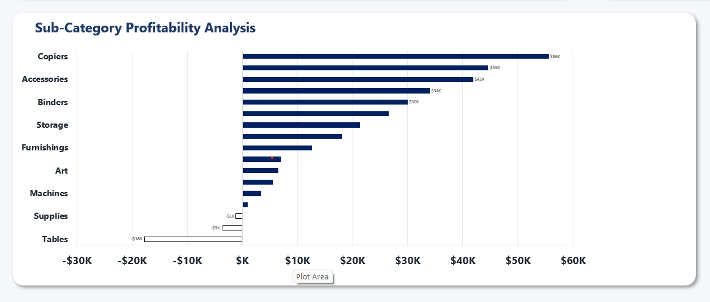

<div align="center">

# Retail Sales Performance Dashboard

**Excel | Pivot Tables | Slicers | Charts | Conditional Formatting**

Built an Excel dashboard analyzing $2.30M in sales across 9,994 orders, 4 regions, 3 product categories, and 3 customer segments to uncover where the business is making money — and where discounts are quietly destroying it.

This is not a reporting tool — it is a decision tool.

It answers one question clearly: **Where are margins being lost, and what needs to change?**


</div>

---

## The Short Version

$2.30M in total sales. $286K in profit. 12.5% overall margin.

The top-line numbers look steady. But underneath, three problems are hiding. The Central region generates $501K in revenue at just 7.9% margin — the worst of any region. The Furniture category contains two sub-categories actively losing money: Tables at -8.6% and Bookcases at -3.0%. And orders with discounts above 20% are not just low-margin — they are loss-making, destroying $82K in profit across 2,209 orders.

This dashboard makes all three problems visible in one view, with one-click filtering by year, region, segment, and category.

---

## The Core Problem

Retail businesses optimise for top-line revenue. Sales grow, orders grow — and the underlying profitability problem grows with them.

The Superstore dataset covers 4 years of US transactions from 2014 to 2017. The business grew every year. But that growth masks a structural discounting problem. Without a clear view of profitability by region, category, discount level, and customer segment — it is impossible to tell which parts of the business are worth investing in and which need correction.

---

## Full Dashboard View


---

## Key Findings

### KPI Summary

Six headline numbers at the top — Total Sales, Total Profit, Profit Margin %, Total Orders, Average Order Value, and Total Quantity — with year-over-year comparison.


| Metric | Value |
|---|---|
| Total Sales | $2,297,201 |
| Total Profit | $286,397 |
| Profit Margin | 12.5% |
| Total Orders | 9,994 |
| Avg Order Value | $230 |

---

### Discounts above 20% destroy profit

0% discount = 22.2% margin. 1–10% discount = 16.3% margin. Cross 20% and the business goes into loss. Every order above 20% discount costs more than it returns.



| Discount Bucket | Orders | Profit Margin |
|---|---|---|
| 0% (No Discount) | 3,612 | 22.2% |
| 1–10% | 2,190 | 16.3% |
| 11–20% | 1,983 | 11.6% |
| 21–30% | 1,312 | -2.2% |
| 31–40% | 582 | -16.3% |
| >40% | 315 | -65.0% |

---

### Central region has the weakest margin

West leads at 14.9% margin. East at 13.5%. South at 11.9%. Central generates $501K in revenue — but at just 7.9% margin, nearly half that of West. Aggressive discounting in Central is the driver.


| Region | Sales | Profit Margin |
|---|---|---|
| West | $725,458 | 14.9% |
| East | $678,781 | 13.5% |
| South | $391,722 | 11.9% |
| Central | $501,240 | 7.9% |

---

### Tables and Bookcases are loss-making products

Tables: $207K in sales at -8.6% margin. Bookcases: $115K in sales at -3.0% margin. Both sit inside Furniture. The cause is excessive discounting — Tables carry an average 30.6% discount, Bookcases 26.1%.


| Sub-Category | Sales | Profit | Margin |
|---|---|---|---|
| Tables | $206,966 | -$17,725 | -8.6% |
| Bookcases | $114,880 | -$3,473 | -3.0% |
| Supplies | $46,674 | -$1,189 | -2.5% |

---

### Q4 drives 35% of annual revenue — every year

The quarterly trend shows a consistent seasonal pattern from 2014 to 2017. Q4 peaks every year. Q1 is always the weakest. The gap between Q1 and Q4 is roughly $170K in a single year.


---

### Home Office is the most profitable segment

Consumer generates $1.16M but at 11.5% margin. Corporate at 13.0%. Home Office is the smallest segment at $430K but the highest margin at 14.0% — Home Office customers receive fewer aggressive discounts.


| Segment | Sales | Profit Margin |
|---|---|---|
| Consumer | $1,161,401 | 11.5% |
| Corporate | $706,146 | 13.0% |
| Home Office | $429,653 | 14.0% |

---

## What Should Be Done

| Problem | Action | Expected Impact |
|---|---|---|
| Orders above 20% discount are loss-making | Set a hard cap at 20% maximum discount across all categories | Eliminates 2,209 loss-making orders per year |
| Tables sub-category losing -$17.7K on $207K revenue | Cap Tables discount at 20% or review for discontinuation | Directly addresses the worst margin drain in Furniture |
| Central region at 7.9% margin vs 14.9% West | Audit which customers are receiving >20% discount in Central | Identifies exactly where the regional margin gap is coming from |
| Home Office at 14% margin but smallest segment | Prioritise Home Office growth — fewer discounts, stronger margin | Revenue growth that does not sacrifice profitability |

---

## What the Dashboard Contains

### KPI Cards
Six numbers at the top — Total Sales, Total Profit, Profit Margin %, Total Orders, Avg Order Value, Total Quantity. Full picture at one glance with year-over-year comparison.

### Quarterly Sales and Profit Trend
Combo chart with sales bars and profit line across all 16 quarters from Q1 2014 to Q4 2017. The Q4 seasonal peak and year-on-year growth are immediately visible.

### Sales by Region
Horizontal bar chart comparing all four regions. Filters down when a region slicer is applied, updating every other chart simultaneously.

### Sales by Category
Bar chart comparing Technology, Office Supplies, and Furniture. Category slicer narrows all charts to the selected category's data.

### Customer Segment Chart
Donut chart showing Consumer, Corporate, and Home Office share of total sales.

### Discount Impact on Margin
Bar chart showing profit margin by discount bucket. The collapse into loss territory above 20% is the most important single visual in the dashboard.

### Sub-category Performance Table
All 17 sub-categories with Sales, Profit, Margin %, Orders, and Avg Discount. Negative margins highlighted in red. Sorted by Sales descending by default.

### Interactive Slicers
Four slicers — Year, Region, Segment, Category — connected to all pivot tables and charts simultaneously. Change any slicer and every chart updates.

---

## Pivot Analysis

Five pivot tables power the analysis — each answering a different business question.

| Pivot | Question It Answers |
|---|---|
| KPI Summary | What are the overall sales, profit, and margin totals? |
| Regional Breakdown | Which regions are driving sales and which have margin problems? |
| Category & Sub-category | Which products are profitable and which are loss-making? |
| Quarterly Trend | How is performance changing across quarters and years? |
| Discount Impact | What happens to margin as discount levels increase? |

All pivots connect to the same slicers so filtering one filters all.


---

## Excel Skills Used

| Feature | Where It Is Used |
|---|---|
| **Pivot Tables** | 5 pivots with calculated fields (Profit Margin %) |
| **Pivot Charts** | Charts built on pivot tables, fully connected to slicers |
| **Slicers** | 4 slicers connected to all pivots simultaneously |
| **Combo Chart** | Quarterly trend — bars for sales, line for profit |
| **Donut Chart** | Customer segment split |
| **Conditional Formatting** | Red highlights on negative margins in sub-category table |
| **SUMIFS** | KPI card calculations, regional and category totals |
| **IF (nested)** | Profit status classification — Positive / Breakeven / Loss |
| **Custom Number Formats** | Currency formatting, percentage formatting, red negatives |
| **Named Tables** | Clean structured references across all formulas |
| **Data Cleaning** | Removed duplicates, fixed data types, standardised date format |

---

## Workbook Structure

| Sheet | What Is Inside |
|---|---|
| **Raw Data** | 9,994 rows of Superstore order data. Named table with added columns: Year, Quarter, Profit Margin %, Discount Bucket. |
| **Pivot Tables** | 5 pivot tables with calculated fields, connected to all slicers. |
| **Dashboard** | KPI cards, 6 charts, 4 slicers. The main deliverable. |
| **Insights** | Key findings and recommendations — specific numbers, specific actions. |

---

## Dataset

**Source:** Kaggle Superstore Sales Dataset — a widely used retail analytics benchmark based on US e-commerce order data.

| Detail | Info |
|---|---|
| File | data/superstore_sales.csv |
| Rows | 9,994 order line items |
| Period | January 2014 – December 2017 |
| Regions | West, East, Central, South |
| Categories | Technology, Office Supplies, Furniture |
| Sub-categories | 17 |
| Segments | Consumer, Corporate, Home Office |
| Fields | Order ID, Order Date, Ship Mode, Customer, Segment, Region, Category, Sub-Category, Product, Sales, Quantity, Discount, Profit |

---

## Project Structure

```
retail-sales-dashboard/
│
├── superstore_sales_dashboard.xlsx   ← The deliverable (full dashboard)
├── README.md                         ← You are reading this
│
├── data/
│   ├── superstore_sales.csv          ← Raw dataset (9,994 rows)
│   ├── superstore_quarterly.csv      ← Quarterly aggregated data
│   ├── superstore_by_region.csv      ← Regional breakdown
│   ├── superstore_by_subcategory.csv ← Sub-category performance
│   ├── superstore_by_segment.csv     ← Customer segment breakdown
│   └── superstore_discount_impact.csv← Discount bucket analysis
│
└── images/
    ├── dashboard_overview.jpg
    ├── dashboard_kpis.jpg
    ├── quarterly_trend.jpg
    ├── regional_performance.jpg
    ├── discount_impact.jpg
    ├── subcategory_table.jpg
    ├── segment_chart.jpg
    └── pivot_analysis.jpg
```

---

## How to Use This Dashboard

1. Download the repo
2. Open `superstore_sales_dashboard.xlsx` in Excel
3. If prompted, click **Enable Content**
4. Go to the **Dashboard** sheet
5. Use the slicers to filter by Year, Region, Segment, or Category
6. All charts and KPI cards update together when any slicer changes
7. Check the **Insights** sheet for key decisions and recommendations

---

## Conclusion

The overall numbers look healthy — sales growing 21.7% year over year, profit up 24.5%. But that growth is hiding a structural discounting problem.

Tables lose 8.6 cents on every dollar of revenue. Central region gives away 7 percentage points of margin compared to West. And 2,209 orders are actively loss-making due to discounts above 20%. These are not edge cases — they are recurring patterns across 4 years of data.

This dashboard makes those patterns visible in one view so decisions happen before the damage compounds.
